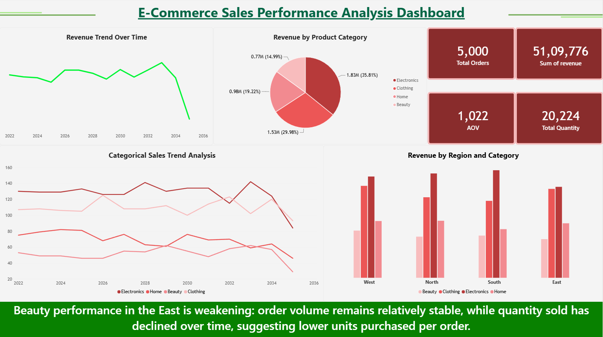

# E-Commerce Sales Performance Analysis

## Project Overview

A Power BI business intelligence project analyzing e-commerce
sales performance to identify revenue trends, category performance,
regional performance, and potential areas of concern.

## Business Problem

The business wants to understand its sales performance over time
and identify categories and regions that require further attention.

## Business Questions

- What is the overall revenue generated?
- How has revenue changed over time?
- Which product categories contribute the most revenue?
- Which regions contribute the most revenue?
- Which category-region combinations are performing relatively weakly?
- What factors may be contributing to weak performance?

## KPIs

- Total Revenue
- Total Orders
- Average Order Value (AOV)
- Total Quantity

## Dashboard

## Key Insights

- Overall revenue declined significantly toward the end of the
  observed period.
- Beauty has the lowest revenue contribution among the product
  categories.
- The East region records the lowest Beauty revenue.
- Beauty quantity sold in the East has declined while order volume
  remains relatively stable.

## Tools Used

- Power BI
- DAX
- Power Query
- Data Visualization
- Business Analysis
